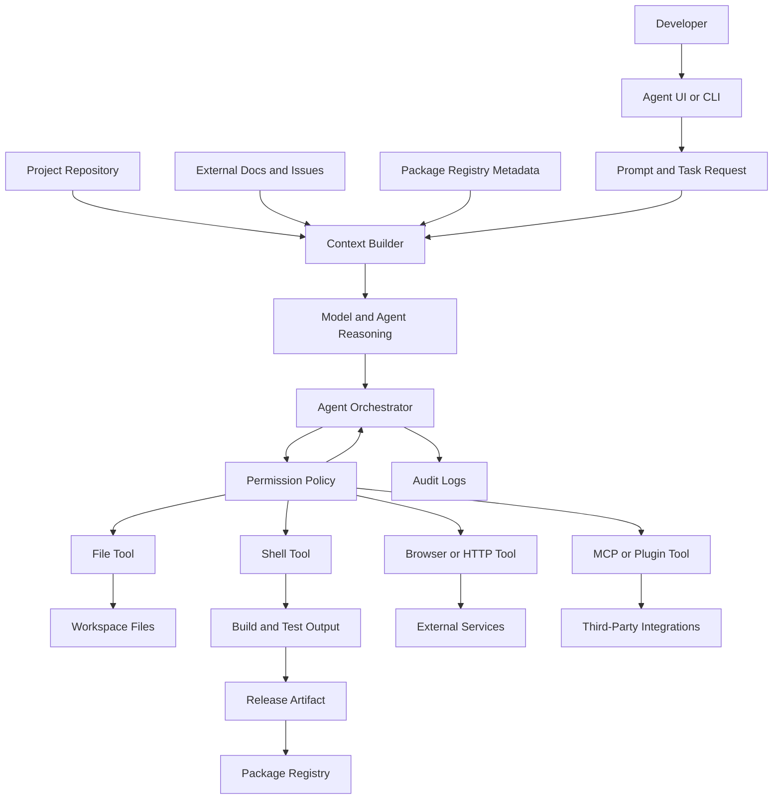
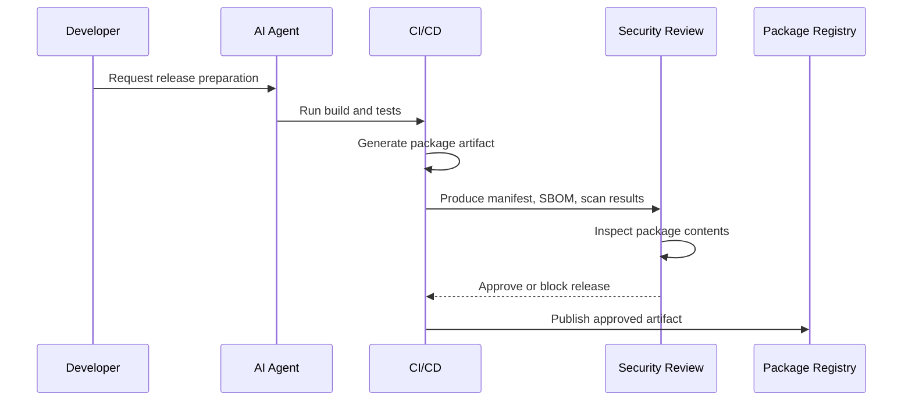
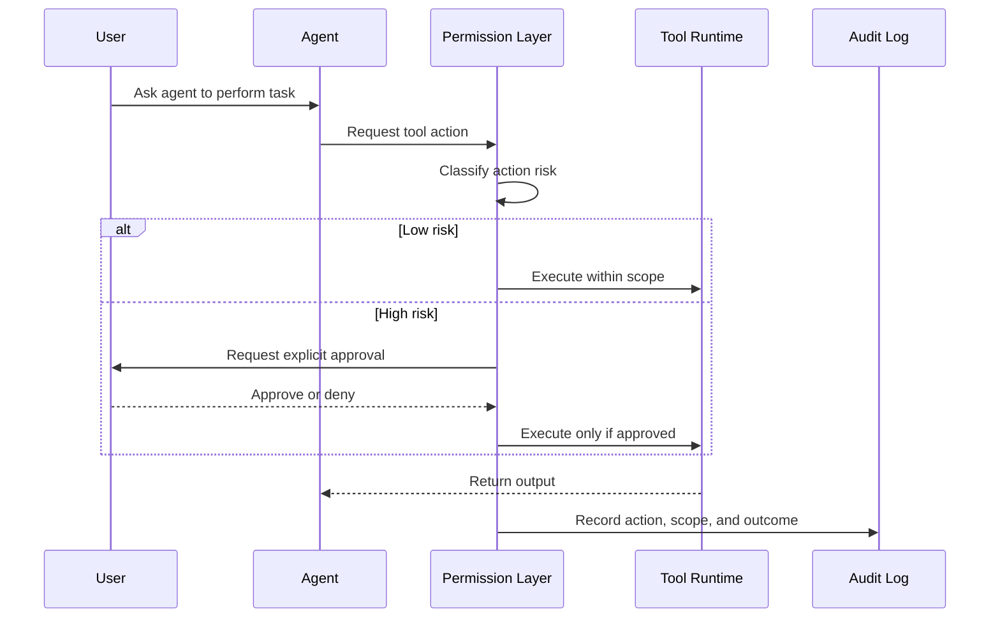

# AI Agent Data Flow

## Purpose

This document describes a clean-room data-flow model for an AI coding agent. It helps reviewers understand where sensitive data enters the system, where trust boundaries exist, and which controls reduce risk.

No leaked or proprietary source code is included. All components and risks are described generically for defensive education.

## High-Level Data Flow

## Data Stores

| Data Store | Example Contents | Primary Risk | Recommended Control |
| --- | --- | --- | --- |
| Workspace files | Source code, config, tests, docs | Sensitive source or secret exposure | File allowlists, path scoping, secret scanning |
| Agent context | Prompt, selected files, tool output | Prompt injection or accidental disclosure | Context minimization and content classification |
| Memory | Past tasks, user preferences, project facts | Cross-project leakage | Retention limits and memory review |
| Tool logs | Commands, diffs, responses | Secrets in logs | Redaction and access controls |
| Build artifacts | Bundles, maps, package archives | Source-map or debug file leakage | Artifact inspection and release allowlists |
| Registry packages | Public package contents | Irreversible public disclosure | Pre-publish approval gates |
| Plugin config | MCP endpoints, credentials, scopes | Supply-chain and credential risk | Signed configs and least privilege |

## Trust Boundaries

| Boundary | Description | Risk |
| --- | --- | --- |
| User prompt to agent | Human-provided task enters model context | Ambiguous or overbroad instructions |
| Repository to context | Project files are selected for reasoning | Malicious instructions embedded in files |
| External content to context | Docs, issues, webpages, package metadata are retrieved | Prompt injection or stale guidance |
| Agent to tools | Reasoning becomes file, shell, network, or API action | Excessive agency or unsafe execution |
| Workspace to package registry | Internal build output becomes public artifact | Accidental source disclosure |
| Plugin to external service | Agent delegates actions to MCP or plugin | Third-party compromise or data exfiltration |
| Logs to reviewers | Sensitive task data is stored for audit | Overcollection or weak log access control |

## Sensitive Data Classification

| Data Type | Sensitivity | Handling Rule |
| --- | --- | --- |
| Public documentation | Low | May be retrieved and summarized |
| Open-source code | Medium | Respect license and attribution requirements |
| Proprietary source code | High | Minimize context and prevent unauthorized disclosure |
| Secrets and tokens | Critical | Never include in prompts, logs, or release artifacts |
| Customer data | Critical | Avoid unless explicitly approved and protected |
| System instructions | High | Treat as policy, not user-editable content |
| Tool output | Variable | Treat as untrusted until validated |

## Release Artifact Flow

Key control point: review the exact artifact that will be published, including generated files, package metadata, source maps, and bundled output.

## Tool Invocation Flow

## Data-Flow Risks and Mitigations

| Risk | Data Flow Point | Impact | Mitigation |
| --- | --- | --- | --- |
| Prompt injection in repository files | Repository to context | Agent follows malicious file instructions | Treat repo text as data; isolate policy instructions |
| Secret leakage to external tools | Context to browser/API/plugin | Credential exposure | Secret scanning, redaction, domain allowlists |
| Source-map disclosure | Build artifact to registry | Original source or architecture exposed | Block unintended `.map` files and inspect package archives |
| Excessive tool access | Agent to tools | Unauthorized file, shell, or network action | Capability-based permissions and approval gates |
| Plugin exfiltration | Plugin to third party | Source or prompt data sent externally | Plugin review, runtime isolation, data minimization |
| Weak logs | Tool logs to reviewers | Missing evidence or sensitive log exposure | Structured audit with redaction |

## Reviewer Notes

This data-flow model highlights practical AppSec review areas:

- The agent is not treated as a single black box.
- Tool execution is modeled as a separate trust boundary.
- Release artifacts are explicitly included because they create public exposure risk.
- Plugin and MCP integrations are treated as supply-chain components.
- The diagram can be extended into architecture review, security testing, or CI/CD policy design.

