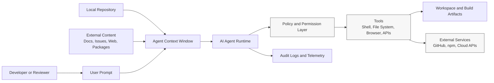

# STRIDE AI Agent Threat Model

## Scope

This threat model covers a generic AI coding agent used by developers to read project files, reason over prompts, call tools, interact with package managers, and assist with code changes.

This document is clean-room and defensive. It does not reference, store, copy, or reproduce leaked or proprietary source code. The scenarios are synthetic and intended for AppSec portfolio review.

## System Assumptions

| Area | Assumption |
| --- | --- |
| Agent type | Developer-facing AI coding assistant or autonomous coding agent |
| Environment | Local workstation, CI worker, remote development environment, or hosted workspace |
| Capabilities | File reads/writes, shell commands, package installation, browser or API calls, plugin/MCP tool use |
| Users | Developers, security engineers, platform engineers, reviewers |
| Sensitive assets | Source code, secrets, credentials, prompts, logs, build artifacts, proprietary business logic |
| Trust model | User prompts, retrieved content, repository files, package scripts, and plugin outputs are not automatically trusted |

## Assets

| Asset | Why It Matters | Example Protection Goal |
| --- | --- | --- |
| Source code | May include proprietary logic or security controls | Prevent unintended disclosure and unauthorized modification |
| Secrets and tokens | Can enable account or infrastructure compromise | Detect, block, and rotate exposed credentials |
| Agent system instructions | Define boundaries and safety rules | Prevent prompt injection from overriding control instructions |
| Tool permissions | Determine what actions the agent can take | Enforce least privilege and approval gates |
| Context and memory | May contain sensitive user or project data | Limit retention and prevent cross-project leakage |
| Build artifacts | May expose source maps, debug files, or internal metadata | Publish only approved package contents |
| Plugin and MCP integrations | Extend agent capability and attack surface | Verify identity, scope, and behavior before use |
| Logs and telemetry | Useful for audit but can contain sensitive data | Redact, access-control, and retain appropriately |

## Trust Boundaries

Key boundaries:

- User-controlled text crosses into the agent context.
- Repository content may contain untrusted instructions.
- External package scripts and documentation may be malicious or stale.
- Tool calls cross from reasoning into real-world side effects.
- Published release artifacts cross from internal build systems to public distribution.

## STRIDE Summary

| STRIDE Category | AI Agent Risk | Example Scenario | Impact | Mitigations |
| --- | --- | --- | --- | --- |
| Spoofing | Tool, plugin, or identity impersonation | A malicious MCP server presents itself as a trusted internal tool | Agent calls an attacker-controlled integration | Signed integrations, allowlisted endpoints, identity verification, user-visible tool names |
| Tampering | Unauthorized file or release artifact modification | Agent modifies CI config or package metadata without review | Unsafe release or weakened security checks | Protected branches, code review, diff review, policy checks, approval gates |
| Repudiation | Weak auditability of agent actions | A risky shell command runs without durable logs | Inability to investigate incident or user intent | Structured audit logs, command provenance, prompt/tool-call correlation |
| Information Disclosure | Exposure of source, secrets, prompts, or source maps | Build publishes `.map` files containing original source content | Proprietary source or internal architecture disclosed | Artifact allowlists, secret scanning, source-map policy, package inspection |
| Denial of Service | Destructive or resource-heavy operations | Agent runs a command that deletes build outputs or exhausts CI resources | Lost work, broken pipeline, cloud cost increase | Sandboxing, quotas, dry-run modes, command risk classification |
| Elevation of Privilege | Agent gains broader permissions than intended | Prompt injection convinces agent to use a privileged deploy token | Unauthorized production or repository action | Least privilege tokens, separate roles, human approval, sensitive action blocking |

## Detailed Threats

### Spoofing

| Threat | Attack Path | Security Control | Reviewer Notes |
| --- | --- | --- | --- |
| Fake plugin identity | User installs an MCP server with a confusing name similar to a trusted tool | Require plugin registry review, signed metadata, and organization allowlists | Look for clear ownership and install provenance |
| Misleading tool output | External tool returns text claiming to be a system instruction | Treat tool output as data, not authority | Agent policy should distinguish trusted policy from retrieved content |
| Repository instruction spoofing | A file named like a policy file contains malicious instructions | Load policy only from approved locations and trusted branches | Useful test case for prompt injection resilience |

### Tampering

| Threat | Attack Path | Security Control | Reviewer Notes |
| --- | --- | --- | --- |
| CI config weakening | Agent changes release workflow to skip scanning | Require code owner review for CI/CD files | Protect `.github/workflows`, package scripts, and release tooling |
| Package metadata manipulation | Agent adds extra files to `package.json` publish scope | Use package allowlists and artifact diffing | Review the exact package tarball, not just source |
| Dependency script tampering | Malicious package install script changes workspace files | Disable lifecycle scripts where practical; isolate installs | Consider lockfile review and dependency provenance |

### Repudiation

| Threat | Attack Path | Security Control | Reviewer Notes |
| --- | --- | --- | --- |
| Missing tool-call audit | Agent performs file or shell actions without traceability | Record prompts, approvals, commands, and outcomes | Logs must avoid capturing secrets in full |
| Ambiguous approval | User approves a broad action without seeing exact command | Show precise action, scope, and risk before approval | High-risk actions should require explicit confirmation |
| No release evidence | Published package lacks artifact review records | Store SBOM, package manifest, checks, and approvals | Supports incident response and compliance review |

### Information Disclosure

| Threat | Attack Path | Security Control | Reviewer Notes |
| --- | --- | --- | --- |
| Source-map leakage | Public package includes `.map` files with `sourcesContent` | Block unintended `.map` files and inspect release artifact | This is a release engineering failure mode |
| Secret exposure through context | Agent sends secrets from local files to a model or external tool | Secret detection, redaction, context minimization | Avoid broad file ingestion |
| Log leakage | Debug logs contain prompts, tokens, or file contents | Redaction, access control, retention limits | Logs need security classification |

### Denial of Service

| Threat | Attack Path | Security Control | Reviewer Notes |
| --- | --- | --- | --- |
| Cost exhaustion | Agent repeatedly calls expensive APIs or cloud tasks | Rate limits, quotas, and budget alerts | Applies to hosted agent platforms and CI |
| Workspace disruption | Agent runs destructive commands in the wrong directory | Sandboxed workspaces, path checks, backups | Sensitive filesystem actions need guardrails |
| Build pipeline overload | Prompt causes repeated dependency installs or test loops | Timeouts, concurrency limits, run cancellation | Useful control for shared CI runners |

### Elevation of Privilege

| Threat | Attack Path | Security Control | Reviewer Notes |
| --- | --- | --- | --- |
| Excessive token scope | Agent has write or admin tokens for routine tasks | Use least privilege and short-lived credentials | Separate read, write, release, and admin roles |
| Approval bypass | Prompt injection persuades the agent to treat a sensitive action as routine | Classify sensitive actions and enforce approval outside the model | Policy enforcement should be deterministic |
| Plugin privilege escalation | Plugin gains file or network access beyond its stated purpose | Capability-based permissions and runtime isolation | Review plugin manifests and actual behavior |

## High-Risk Actions Requiring Approval

| Action | Example Risk | Recommended Gate |
| --- | --- | --- |
| Publishing packages | Accidental release of source maps, secrets, or internal files | Package inspection plus human approval |
| Running destructive file operations | Data loss or workspace corruption | Explicit path-scoped approval |
| Installing dependencies | Supply-chain exposure or lifecycle script execution | Dependency review and script policy |
| Using external network tools | Data exfiltration or untrusted output ingestion | Domain allowlist and context minimization |
| Modifying CI/CD workflows | Security checks may be weakened | Code owner review |
| Accessing secrets | Credential disclosure | Just-in-time access and redaction |

## Mitigation Themes

| Theme | Practical Control |
| --- | --- |
| Least privilege | Give the agent only the tools and tokens required for the task |
| Human approval | Require approval for sensitive actions before execution |
| Deterministic policy | Enforce restrictions outside model-generated reasoning |
| Isolation | Run agent tasks in disposable workspaces or containers |
| Artifact review | Inspect published package contents before release |
| Logging | Record prompts, tool calls, approvals, and release evidence |
| Supply-chain review | Verify plugins, MCP servers, dependencies, and package scripts |
| Context hygiene | Minimize sensitive files, secrets, and long-lived memory |

## Reviewer Notes

This model is designed to show recruiter-relevant security thinking:

- It treats AI agent risk as AppSec, platform security, and release engineering.
- It avoids sensational claims and focuses on realistic failure modes.
- It separates model behavior from deterministic security controls.
- It emphasizes artifact-level verification for npm and CLI releases.
- It can be extended into hands-on labs without using proprietary material.

